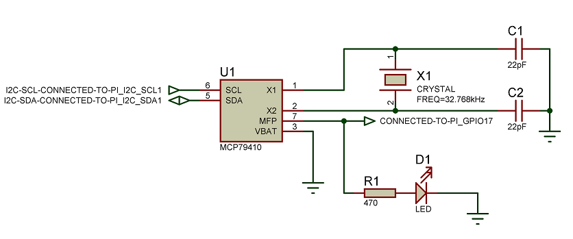

# Overview

These examples demonstrate simple uses of Erlang/ALE. To compile then, just
run:

    make

The examples can be run via Makefile targets.

# gpio_counter

For this example, connect a button to GPIO 17 and another button to GPIO 22.
Connect GPIO 23 and GPIO 24 to LEDs. Pressing the button on GPIO 22 will increase
the "count" on the LEDs and the GPIO 17 button will decrease it.

# ex_gpio_int

For this example connect GPIO 27 to GPIO 22. GPIO 27 will be the interrupt pin,
and GPIO 22 will provides the signals to generate interrupts.
To generate interrupts just use ex_gpio_int:press_btn/0 and ex_gpio_int:release_btn/0
functions.
The default interrupt condition is rising, but it is possible change it by
ex_gpio_int:set_int_condition/1 function, where the input parameter can be:
falling | rising | both | none | enabled | summarize

Step-by-step:

	cd example
	make all
	make shell

Start test application when rising interrupt edge will generates interrupt by ex_gpio_int:start_link/0
	
	26> ex_gpio_int:start_link().
	
	=INFO REPORT==== 30-Apr-2015::18:43:49 ===
	    "ALE driver process has been started and registered successfully."
	    initialMFA: {ale_handler,gpio_set_int,[27,rising,<0.83.0>]}
	    drvModule: gpio
	    drvStartFunction: start_link
	    drvStartArgs: [27,input]
	    drvPid: <0.86.0>
	    module: ale_handler
	    line: 733
	{ok,<0.83.0>}
	27>
	
Simulate release press event by ex_gpio_int:release_btn/0
	
	27> ex_gpio_int:release_btn().

Simulate press press event by ex_gpio_int:press_btn/0
Rising interrupt event has been received by test application from driver:

	29> ex_gpio_int:press_btn().
	
	=INFO REPORT==== 30-Apr-2015::18:46:16 ===
	    "Interrupt has been occurred."
	    gpio: 27
	    interrupt_condition: rising
	ok
	30>

Release the button by ex_gpio_int:release_btn/0. No interrupt event should be received by test application at this time.
	
	30> ex_gpio_int:release_btn().
	ok
	31>
	
Press the button again and see, rising interrupt has been received again:

	31> ex_gpio_int:press_btn().
	
	=INFO REPORT==== 30-Apr-2015::18:46:58 ===
	    "Interrupt has been occurred."
	    gpio: 27
	    interrupt_condition: rising
	ok
	32>

Change the interrupt condition to falling edge.

	32> ex_gpio_int:set_int_condition(falling).
	ok
	33>

Release the pressed button. Falling interrupt event should be received by the test application:

	33> ex_gpio_int:release_btn().
	
	=INFO REPORT==== 30-Apr-2015::18:47:39 ===
	    "Interrupt has been occurred."
	    gpio: 27
	    interrupt_condition: falling
	ok
	34>

# ex_mcp23x17:start_i2c_blinking_led/4

This example shows how to blinking a LED connected to the a PIN of I2C IO expander device.

Here is the schematic about circuit:

	Before try out this example, the following preparation needs to be done on the IO expander device:
	-  Connect MCP23017 IO expander Pins:
		PIN9  - VDD
		PIN10 - VSS
		PIN12 - I2C-SCL -> Raspberry Pi PIN5
		PIN13 - I2C-SDA -> Raspberry Pi PIN3
		PIN15 - VSS
		PIN16 - VSS
		PIN17 - VSS
		PIN18 - VDD
		PIN21 - LED with 470ohm serial resistor -> VSS
		
		HwAddr	: 16#20, because all Ax PINs are connected to VSS (Ground)
		Port	: IO expander device has 2 Ports, 'A' and 'B'. In this example we are using Port 'A'.
		Pin		: There are 8 PINS on each port side. In this example we are using PIN0.
		Timer	: The periodic time of blinking in msec.
		
		Start blinking LED:
		-------------------
		23> ex_mcp23x17:stop_spi_blinking_led(32, 'A', 0).
		
		=INFO REPORT==== 30-Apr-2015::18:40:53 ===
		    "Processis going to be stopped."
		    processName: spi_32_A_0
		    module: ex_mcp23x17
		    line: 110
		
		=INFO REPORT==== 30-Apr-2015::18:40:53 ===
		    "ALE driver has been released."
		    drvPid: <0.75.0>
		    initialMFA: {ale_handler,spi_transfer,["spidev0.0",[],<<65,20,0>>]}
		    drvInitMFA: {spi,start_link,["spidev0.0",[]]}
		    module: ale_handler
		    line: 790
		
		=INFO REPORT==== 30-Apr-2015::18:40:53 ===
		    "ALE driver has been released."
		    drvPid: <0.73.0>
		    initialMFA: {ale_handler,i2c_write,["i2c-1",32,<<20>>]}
		    drvInitMFA: {i2c,start_link,["i2c-1",32]}
		    module: ale_handler
		    line: 790
		ok
		
		Stop blinking LED:
		------------------
		24> ex_mcp23x17:start_i2c_blinking_led(16#20, 'A', 0, 200).
		
		=INFO REPORT==== 30-Apr-2015::18:41:24 ===
		    "ALE driver process has been started and registered successfully."
		    initialMFA: {ale_handler,i2c_write,["i2c-1",32,<<0>>]}
		    drvModule: i2c
		    drvStartFunction: start_link
		    drvStartArgs: ["i2c-1",32]
		    drvPid: <0.80.0>
		    module: ale_handler
		    line: 733
		
		=INFO REPORT==== 30-Apr-2015::18:41:24 ===
		    "Process has been started."
		    processName: i2c_32_A_0
		    module: ex_mcp23x17
		    line: 56
		ok
		25> ex_mcp23x17:stop_i2c_blinking_led(16#20, 'A', 0).
		
		=INFO REPORT==== 30-Apr-2015::18:41:39 ===
		    "Process is going to be stopped."
		    processName: i2c_32_A_0
		    module: ex_mcp23x17
		    line: 72
		
		=INFO REPORT==== 30-Apr-2015::18:41:39 ===
		    "ALE driver has been released."
		    drvPid: <0.80.0>
		    initialMFA: {ale_handler,i2c_write,["i2c-1",32,<<0>>]}
		    drvInitMFA: {i2c,start_link,["i2c-1",32]}
		    module: ale_handler
		    line: 790
		ok
		26>

# ex_mcp23x17:start_spi_blinking_led/4

This example shows how to blinking a LED connected to the a PIN of SPI IO expander device, when CS PIN of the IO expander is connect to NOT Raspberry Pi's SPI_CS PIN, but connected to a PIN of an I2C IO expander device.

Here is the schematic about the circuit:

	Before try out this example, the following preparation needs to be done on the IO expander devices:
	
	-  Connect MCP23017 (I2C) IO expander Pins:
		PIN9  - VDD
		PIN10 - VSS
		PIN12 - I2C-SCL -> Raspberry Pi PIN5
		PIN13 - I2C-SDA -> Raspberry Pi PIN3
		PIN15 - VSS
		PIN16 - VSS
		PIN17 - VSS
		PIN18 - VDD
		PIN22 - PIN11 on SPI IO expander
		
	- Connect MCP23S17 (SPI) IO expander Pins:
		PIN9  - VDD
		PIN10 - VSS
		PIN11 - SPI_CS  -> PIN22 on I2C IO expander
		PIN12 - SPI-SCL -> Raspberry Pi PIN23
		PIN13 - SPI-SI  -> Raspberry Pi PIN19 (SPI_MOSI)
		PIN14 - SPI-SO  -> Raspberry Pi PIN21 (SPI_MISO)
		PIN15 - VSS
		PIN16 - VSS
		PIN17 - VSS
		PIN18 - VDD
		PIN21 - LED with 470ohm serial resistor -> VSS
		
		Start blinking LED:
		-------------------
		21> ex_mcp23x17:start_spi_blinking_led(32, 'A', 0, 200).
		
		=INFO REPORT==== 30-Apr-2015::18:39:10 ===
		    "ALE driver process has been started and registered successfully."
		    initialMFA: {ale_handler,i2c_write,["i2c-1",32,<<0>>]}
		    drvModule: i2c
		    drvStartFunction: start_link
		    drvStartArgs: ["i2c-1",32]
		    drvPid: <0.64.0>
		    module: ale_handler
		    line: 733
		
		=INFO REPORT==== 30-Apr-2015::18:39:10 ===
		    "ALE driver process has been started and registered successfully."
		    initialMFA: {ale_handler,spi_transfer,["spidev0.0",[],<<65,0,0>>]}
		    drvModule: spi
		    drvStartFunction: start_link
		    drvStartArgs: ["spidev0.0",[]]
		    drvPid: <0.66.0>
		    module: ale_handler
		    line: 733
		
		=INFO REPORT==== 30-Apr-2015::18:39:10 ===
		    "Process has been started."
		    processName: spi_32_A_0
		    module: ex_mcp23x17
		    line: 94
		ok

		
		Stop blinking LED:
		-------------------
		23> ex_mcp23x17:stop_spi_blinking_led(32, 'A', 0).
		
		=INFO REPORT==== 30-Apr-2015::18:40:53 ===
		    "Processis going to be stopped."
		    processName: spi_32_A_0
		    module: ex_mcp23x17
		    line: 110
		
		=INFO REPORT==== 30-Apr-2015::18:40:53 ===
		    "ALE driver has been released."
		    drvPid: <0.75.0>
		    initialMFA: {ale_handler,spi_transfer,["spidev0.0",[],<<65,20,0>>]}
		    drvInitMFA: {spi,start_link,["spidev0.0",[]]}
		    module: ale_handler
		    line: 790
		
		=INFO REPORT==== 30-Apr-2015::18:40:53 ===
		    "ALE driver has been released."
		    drvPid: <0.73.0>
		    initialMFA: {ale_handler,i2c_write,["i2c-1",32,<<20>>]}
		    drvInitMFA: {i2c,start_link,["i2c-1",32]}
		    module: ale_handler
		    line: 790
		ok

# ex_mcp7940n - Configure Date&Time and Alarm in RTC device
This example introduces how to configure Date&Time in MCP7940n RTC device and it also shows how easy to configure alarm module for a specific Date&Time.
For this example GPIO-17 on Raspberry has been used as an input PIN. This PIN will receives the interrupts from RTC device. The below schematic can say much more about it.

The current Date&Time (LOCALTIME) will be configured into the RTC device when start the test application and ALARM-0 module will be configured to LOCALTIME+1[min]. The GPIO-17 PIN on PI is used as interrupt PIN. This PIN is configured for able to receive interrupts from RTC device. Below printout shows the whole sequence.
	
	1> ex_mcp7940n:start().
	
	=INFO REPORT==== 1-May-2015::19:03:14 ===
	    "ALE driver process has been started and registered successfully."
	    initialMFA: {ale_handler,i2c_write,["i2c-1",111,<<3>>]}
	    drvModule: i2c
	    drvStartFunction: start_link
	    drvStartArgs: ["i2c-1",111]
	    drvPid: <0.39.0>
	    module: ale_handler
	    line: 733
	
	=INFO REPORT==== 1-May-2015::19:03:14 ===
	    "RTC oscillator has been stopped"
	    module: mcp7940n
	    line: 1687
	
	=INFO REPORT==== 1-May-2015::19:03:14 ===
	    "Alarm interrupt has been disabled"
	    alarmId: 0
	    module: mcp7940n
	    line: 1344
	
	=INFO REPORT==== 1-May-2015::19:03:14 ===
	    "Alarm interrupt has been disabled"
	    alarmId: 1
	    module: mcp7940n
	    line: 1344
	
	=INFO REPORT==== 1-May-2015::19:03:14 ===
	    "Year has been set in RTC"
	    regType: rtcYearReg
	    module: mcp7940n
	    line: 1802
	
	=INFO REPORT==== 1-May-2015::19:03:14 ===
	    "Month has been set in RTC"
	    regType: rtcMonthReg
	    module: mcp7940n
	    line: 1845
	
	=INFO REPORT==== 1-May-2015::19:03:14 ===
	    "Date has been set in RTC"
	    regType: rtcDateReg
	    module: mcp7940n
	    line: 1888
	
	=INFO REPORT==== 1-May-2015::19:03:14 ===
	    "WDay has been set in RTC"
	    regType: rtcWkDayReg
	    module: mcp7940n
	    line: 2108
	
	=INFO REPORT==== 1-May-2015::19:03:14 ===
	    "Hour has been set in RTC"
	    regType: rtcHourReg
	    module: mcp7940n
	    line: 1979
	
	=INFO REPORT==== 1-May-2015::19:03:14 ===
	    "Minute has been set in RTC"
	    regType: rtcMinuteReg
	    module: mcp7940n
	    line: 2021
	
	=INFO REPORT==== 1-May-2015::19:03:14 ===
	    "Second has been set in RTC"
	    regType: rtcSecondReg
	    module: mcp7940n
	    line: 2066
	
	=INFO REPORT==== 1-May-2015::19:03:14 ===
	    "Alarm interrupt has been disabled"
	    alarmId: 0
	    module: mcp7940n
	    line: 1344
	
	=INFO REPORT==== 1-May-2015::19:03:14 ===
	    "Alarm interrupt has been disabled"
	    alarmId: 1
	    module: mcp7940n
	    line: 1344
	
	=INFO REPORT==== 1-May-2015::19:03:14 ===
	    "RTC oscillator has been started"
	    module: mcp7940n
	    line: 1664
	
	=INFO REPORT==== 1-May-2015::19:03:14 ===
	    "Date and Time has been configured in RTC"
	    dateAndTime: {{2015,5,1},{19,3,14}}
	    module: mcp7940n
	    line: 1757
	
	=INFO REPORT==== 1-May-2015::19:03:14 ===
	    "CONTROL REG OUT bit has been set"
	    module: mcp7940n
	    line: 1026
	
	=INFO REPORT==== 1-May-2015::19:03:14 ===
	    "CONTROL REG SQWEN bit has been set"
	    module: mcp7940n
	    line: 1048
	
	=INFO REPORT==== 1-May-2015::19:03:14 ===
	    "CONTROL REG EXTOSC bit has been set"
	    module: mcp7940n
	    line: 1070
	
	=INFO REPORT==== 1-May-2015::19:03:14 ===
	    "CONTROL REG CRSTRIM bit has been set"
	    module: mcp7940n
	    line: 1092
	
	=INFO REPORT==== 1-May-2015::19:03:14 ===
	    "CONTROL REG SQWFS bit has been set"
	    module: mcp7940n
	    line: 1114
	
	=INFO REPORT==== 1-May-2015::19:03:14 ===
	    "VBATEN bit has been set"
	    module: mcp7940n
	    line: 1265
	
	=INFO REPORT==== 1-May-2015::19:03:14 ===
	    "Alarm interrupt has been disabled"
	    alarmId: 0
	    module: mcp7940n
	    line: 1344
	
	=INFO REPORT==== 1-May-2015::19:03:14 ===
	    "Alarm interrupt has been disabled"
	    alarmId: 1
	    module: mcp7940n
	    line: 1344
	
	=INFO REPORT==== 1-May-2015::19:03:14 ===
	    "RTC oscillator has been started"
	    module: mcp7940n
	    line: 1664
	
	=INFO REPORT==== 1-May-2015::19:03:15 ===
	    "RTC has been started"
	    module: mcp7940n
	    line: 610
	
	=INFO REPORT==== 1-May-2015::19:03:15 ===
	    "ALE driver process has been started and registered successfully."
	    initialMFA: {ale_handler,gpio_set_int,[17,rising,<0.35.0>]}
	    drvModule: gpio
	    drvStartFunction: start_link
	    drvStartArgs: [17,input]
	    drvPid: <0.41.0>
	    module: ale_handler
	    line: 733
	
	=INFO REPORT==== 1-May-2015::19:03:15 ===
	    "INT_PIN (GPIO-17) and interrupt conditions have been configured"
	    result: ok
	{ok,<0.35.0>}
	2>

Configure ALARM-0 module. This part of the example shows how to configure alarm module in RTC. The alarm Date&Time will be the current Date&Time in RTC + 1 [min].

	2> ex_mcp7940n:alarm_configure().

	=INFO REPORT==== 1-May-2015::19:08:04 ===
	    "Month has been set in RTC"
	    regType: rtcAlm0MonthReg
	    module: mcp7940n
	    line: 1845
	
	=INFO REPORT==== 1-May-2015::19:08:04 ===
	    "Date has been set in RTC"
	    regType: rtcAlm0DateReg
	    module: mcp7940n
	    line: 1888
	
	=INFO REPORT==== 1-May-2015::19:08:04 ===
	    "WDay has been set in RTC"
	    regType: rtcAlm0WDayReg
	    module: mcp7940n
	    line: 2108
	
	=INFO REPORT==== 1-May-2015::19:08:04 ===
	    "Hour has been set in RTC"
	    regType: rtcAlm0HourReg
	    module: mcp7940n
	    line: 1979
	
	=INFO REPORT==== 1-May-2015::19:08:04 ===
	    "Minute has been set in RTC"
	    regType: rtcAlm0MinReg
	    module: mcp7940n
	    line: 2021
	
	=INFO REPORT==== 1-May-2015::19:08:04 ===
	    "Second has been set in RTC"
	    regType: rtcAlm0SecReg
	    module: mcp7940n
	    line: 2066
	
	=INFO REPORT==== 1-May-2015::19:08:04 ===
	    "Alarm interrupt has been enabled"
	    alarmId: 0
	    module: mcp7940n
	    line: 1312
	
	=INFO REPORT==== 1-May-2015::19:08:04 ===
	    "Alarm interrupt has been configured"
	    alarmId: 0
	    module: mcp7940n
	    line: 1481
	ok
	3>

An interrupt received when Date&Time reached the configured Alarm Date&Time:
	
	3>
	=INFO REPORT==== 1-May-2015::19:09:03 ===
	    "RTC interrupt has been occurred."
	    gpio: 17
	    interrupt_condition: rising
	
	3>
	
The LED connected to the GPIO-17 should LIGHT for a very short time when the interrupt received, and will be OFF when test application has been done with clearing RTC interrupt flag bit.

# ex_mcp7940n - Subscribe to Main Power Change Event

Test application subscribes to "Main Power Status Change Event". With this feature application can be informed when the power of RTC lost and also will be informed when it will back to operation. For demonstrate the how it works, subscribe on "Main Power Status Change Event", than disconnect Vcc wire of RTC device.
	
This is how to subscribe to the notification
	
	3> ex_mcp7940n:pwr_status_change_subscribe().
	
	=INFO REPORT==== 1-May-2015::19:11:06 ===
	    "Pid has been subscribed to the PWR change notification"
	    pid: <0.35.0>
	    module: mcp7940n
	    line: 674
	ok
	4>
	
Report when disconnect Vcc wire of RTC
	
	4>
	=INFO REPORT==== 1-May-2015::19:17:49 ===
	    "Main power of RTC is lost"
	    module: mcp7940n
	    line: 878

This is the info message when the notification received in the test application.

	=INFO REPORT==== 1-May-2015::19:17:49 ===
	Main power of RTC is lost

Connect Vcc leg of RTC to power and see what messages are coming. The first will be an "unexpected" interrupt. This is not a bug, Pi's kernel reports
a "fake" interrupt. This needs to be ignored, but I'm working on a nice solution.
More info messages are printed out next to the interrupt.

	4>
	=ERROR REPORT==== 1-May-2015::19:19:54 ===
	    "Unexpected interrupt has been occurred - alarm flag does not matches."
	    gpio: 17
	    interrupt_condition: rising
	    expectedAlarmModule: 0
	    expectedAlarmFlag: 1
	    readAlarmFlag: 0
	    intGpioLogicalStatus: 0
	    'ALM0-IF': {ok,0}
	    'ALM1-IF': {ok,0}
	
	=INFO REPORT==== 1-May-2015::19:19:55 ===
	    "PWRFAIL bit has been cleared"
	    module: mcp7940n
	    line: 1159
	
	=INFO REPORT==== 1-May-2015::19:19:55 ===
	    "Main power of RTC is back"
	    module: mcp7940n
	    line: 840
	
This is the info message when the notification received in the test application.

	=INFO REPORT==== 1-May-2015::19:19:55 ===
	    "Main power of RTC is back"
	    powerDownTime: {ok,{{2015,5,1},{19,19,0}}}
	    powerUpTime: {ok,{{2015,5,1},{19,19,0}}}

# ex_mcp7940n - Subscribe to Main Power Change Event

It is possible subscribe (unsubscribe) to RTC oscillator change event. This is useful because application can be informed when RTC oscillator disabled, enabled or it has some problem. Below example shows how to subscribe to the event, and shows what messages can be seen when stop RTC oscillator by software.

Subscribe 
	4> ex_mcp7940n:osc_status_change_subscribe().
	
	=INFO REPORT==== 1-May-2015::19:49:35 ===
	    "Pid has been subscribed to the OSCILLATOR change notification"
	    pid: <0.35.0>
	    module: mcp7940n
	    line: 722
	ok
	5>
	=INFO REPORT==== 1-May-2015::19:49:36 ===
	    "RTC oscillator is running"
	    module: mcp7940n
	    line: 899
	
	=INFO REPORT==== 1-May-2015::19:49:36 ===
	RTC oscillator is running
	
	5>

Stop RTC oscillator

	5> mcp7940n:oscillator_stop().

The next messages are printed out

	=INFO REPORT==== 1-May-2015::19:54:45 ===
	    "RTC oscillator has been stopped"
	    module: mcp7940n
	    line: 1687
	ok
	6>
	=ERROR REPORT==== 1-May-2015::19:54:45 ===
	    "RTC oscillator is not running"
	    module: mcp7940n
	    line: 950
	
This is the printout in test application when it gets the notification about oscillator status change

	=ERROR REPORT==== 1-May-2015::19:54:45 ===
	    "RTC oscillator is not running"
	    info: {'ST bit',{0,osc_not_started}}

Turn ON RTC oscillator

	6> mcp7940n:oscillator_start().
	
	=INFO REPORT==== 1-May-2015::19:56:27 ===
	    "RTC oscillator has been started"
	    module: mcp7940n
	    line: 1664
	ok
	7>
	=INFO REPORT==== 1-May-2015::19:56:30 ===
	    "RTC oscillator is running"
	    module: mcp7940n
	    line: 914
	
This is the printout in test application when it gets the notification about oscillator status change

	=INFO REPORT==== 1-May-2015::19:56:30 ===
	RTC oscillator is running
	
	7>

More can be seen in the source code. Enjoy :-)

