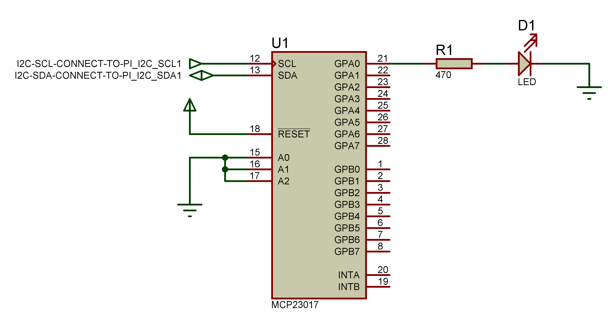
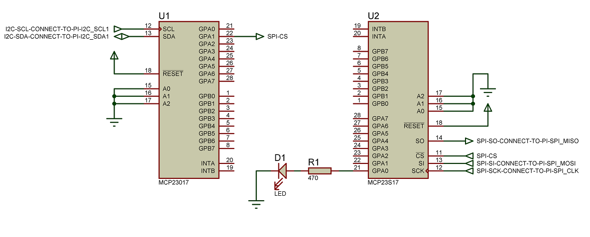

# Overview

These examples demonstrate simple uses of Erlang/ALE. To compile then, just
run:

    make

The examples can be run via Makefile targets.

# gpio_counter

For this example, connect a button to GPIO 17 and another button to GPIO 22.
Connect GPIO 23 and GPIO 24 to LEDs. Pressing the button on GPIO 22 will increase
the "count" on the LEDs and the GPIO 17 button will decrease it.

# ale_handler_gpio_int_test

For this example connect GPIO 27 to GPIO 22. GPIO 27 will be the interrupt pin,
and GPIO 22 will provides the signals to generate interrupts.
To generate interrupts just use ale_handler_gpio_int_test:press_btn/0 and ale_handler_gpio_int_test:release_btn/0
functions.
The default interrupt condition is rising, but it is possible change it by
ale_handler_gpio_int_test:set_int_condition/1 function, where the input parameter can be:
falling | rising | both | none | enabled | summarize

Step-by-step:

	cd example
	make all
	make shell

Start test application when rising interrupt edge will generates interrupt by ale_handler_gpio_int_test:start_link/0
	
	5> ale_handler_gpio_int_test:start_link().
	=INFO REPORT==== 22-Apr-2015::05:55:19 ===
	    "ALE driver process has been started and registered successfully."
	    drvModule: gpio
	    drvStartFunction: start
	    drvStartArgs: [27,input]
	    drvPid: <0.46.0>
	    monitorRef: #Ref<0.0.0.62>
	{ok,<0.44.0>}
	
Simulate button press event by 
	ale_handler_gpio_int_test:press_btn/0
	
	8> ale_handler_gpio_int_test:press_btn().
	=INFO REPORT==== 22-Apr-2015::05:55:51 ===
	    "ALE driver process has been started and registered successfully."
	    drvModule: gpio
	    drvStartFunction: start
	    drvStartArgs: [22,output]
	    drvPid: <0.50.0>
	    monitorRef: #Ref<0.0.0.83>
	ok
	9>
Rising interrupt event has been received by test application from driver:

	=INFO REPORT==== 22-Apr-2015::05:55:51 ===
	    "Interrupt has been occurred."
	    gpio: 27
	    interrupt_condition: rising

Release the button by ale_handler_gpio_int_test:release_btn/0. No interrupt event should be received by test application at this time.
	
	9> ale_handler_gpio_int_test:release_btn().
	ok
	10>
	
Press the button again and see, rising interrupt has been received again:

	10> ale_handler_gpio_int_test:press_btn().
	
	=INFO REPORT==== 22-Apr-2015::05:56:24 ===
	    "Interrupt has been occurred."
	    gpio: 27
	    interrupt_condition: rising
	ok

Change the interrupt condition to falling edge.

	11> ale_handler_gpio_int_test:set_int_condition(falling).
	ok

Release the pressed button. Falling interrupt event should be received by the test application:

	12> ale_handler_gpio_int_test:press_btn().
	ok
	12> ale_handler_gpio_int_test:release_btn().
	
	=INFO REPORT==== 22-Apr-2015::05:56:42 ===
	    "Interrupt has been occurred."
	    gpio: 27
	    interrupt_condition: falling
	ok
	13>

# ex_mcp23x17:start_i2c_blinking_led/4

This example shows how to blinking a LED connected to the a PIN of I2C IO expander device.

Here is the schematic about circuit:

	Before try out this example, the following preparation needs to be done on the IO expander device:
	-  Connect MCP23017 IO expander Pins:
		PIN9  - VDD
		PIN10 - VSS
		PIN12 - I2C-SCL -> Raspberry Pi PIN5
		PIN13 - I2C-SDA -> Raspberry Pi PIN3
		PIN15 - VSS
		PIN16 - VSS
		PIN17 - VSS
		PIN18 - VDD
		PIN21 - LED with 470ohm serial resistor -> VSS
		
		HwAddr	: 16#20, because all Ax PINs are connected to VSS (Ground)
		Port	: IO expander device has 2 Ports, 'A' and 'B'. In this example we are using Port 'A'.
		Pin		: There are 8 PINS on each port side. In this example we are using PIN0.
		Timer	: The periodic time of blinking in msec.
		
		Start blinking LED:
		-------------------
		3> ex_mcp23x17:start_i2c_blinking_led(16#20, 'A', 0, 200).
		
		=INFO REPORT==== 10-Apr-2015::12:21:46 ===
		    "ALE driver process has been started and registered successfully."
		    drvModule: i2c
		    drvStartFunction: start
		    drvStartArgs: ["i2c-1",32]
		    drvPid: <0.44.0>
		    monitorRef: #Ref<0.0.0.1550>
		ok
		
		Stop blinking LED:
		------------------
		4> ex_mcp23x17:stop_i2c_blinking_led().
		
		=INFO REPORT==== 10-Apr-2015::12:21:57 ===
		    "ALE driver has been released."
		    drvPid: <0.44.0>
		    record_in_ets: {rALEHandler,{i2c,"i2c-1",32},
		                                {ale_handler,i2c_write,["i2c-1",32,<<0>>]},
		                                <0.44.0>,#Ref<0.0.0.1550>}
		ok
		5>

# ex_mcp23x17:start_spi_blinking_led/4

This example shows how to blinking a LED connected to the a PIN of SPI IO expander device, when CS PIN of the IO expander is connect to NOT Raspberry Pi's SPI_CS PIN, but connected to a PIN of an I2C IO expander device.

Here is the schematic about the circuit:

	Before try out this example, the following preparation needs to be done on the IO expander devices:
	
	-  Connect MCP23017 (I2C) IO expander Pins:
		PIN9  - VDD
		PIN10 - VSS
		PIN12 - I2C-SCL -> Raspberry Pi PIN5
		PIN13 - I2C-SDA -> Raspberry Pi PIN3
		PIN15 - VSS
		PIN16 - VSS
		PIN17 - VSS
		PIN18 - VDD
		PIN22 - PIN11 on SPI IO expander
		
	- Connect MCP23S17 (SPI) IO expander Pins:
		PIN9  - VDD
		PIN10 - VSS
		PIN11 - SPI_CS  -> PIN22 on I2C IO expander
		PIN12 - SPI-SCL -> Raspberry Pi PIN23
		PIN13 - SPI-SI  -> Raspberry Pi PIN19 (SPI_MOSI)
		PIN14 - SPI-SO  -> Raspberry Pi PIN21 (SPI_MISO)
		PIN15 - VSS
		PIN16 - VSS
		PIN17 - VSS
		PIN18 - VDD
		PIN21 - LED with 470ohm serial resistor -> VSS
		
		Start blinking LED:
		-------------------
		1> ex_mcp23x17:start_spi_blinking_led(32, 'A', 0, 200).
		
		=INFO REPORT==== 10-Apr-2015::12:20:06 ===
		    "ALE driver process has been started and registered successfully."
		    drvModule: i2c
		    drvStartFunction: start
		    drvStartArgs: ["i2c-1",32]
		    drvPid: <0.38.0>
		    monitorRef: #Ref<0.0.0.35>
		
		=INFO REPORT==== 10-Apr-2015::12:20:06 ===
		    "ALE driver process has been started and registered successfully."
		    drvModule: spi
		    drvStartFunction: start
		    drvStartArgs: ["spidev0.0",[]]
		    drvPid: <0.39.0>
		    monitorRef: #Ref<0.0.0.51>
		ok
		
		Stop blinking LED:
		-------------------
		2> ex_mcp23x17:stop_spi_blinking_led().
		
		=INFO REPORT==== 10-Apr-2015::12:20:15 ===
		    "ALE driver has been released."
		    drvPid: <0.39.0>
		    record_in_ets: {rALEHandler,
		                       {spi,"spidev0.0",[]},
		                       {ale_handler,spi_transfer,["spidev0.0",[],<<65,0,0>>]},
		                       <0.39.0>,#Ref<0.0.0.51>}
		
		=INFO REPORT==== 10-Apr-2015::12:20:15 ===
		    "ALE driver has been released."
		    drvPid: <0.38.0>
		    record_in_ets: {rALEHandler,{i2c,"i2c-1",32},
		                                {ale_handler,i2c_write,["i2c-1",32,<<0>>]},
		                                <0.38.0>,#Ref<0.0.0.35>}
		ok
		3>

